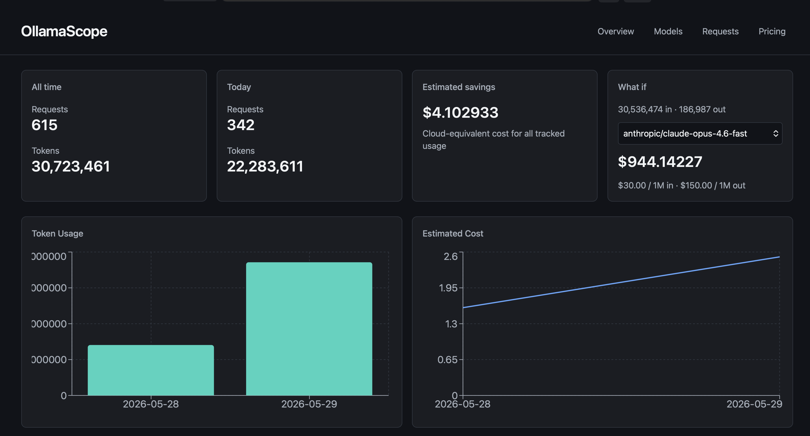

# OllamaScope

OllamaScope is a small self-hosted proxy and dashboard for Ollama usage.

It listens on:

- Dashboard: `http://localhost:3000`
- Ollama proxy: `http://localhost:11435`

Point clients at `http://localhost:11435` instead of `http://localhost:11434`. All Ollama API paths are forwarded to `OLLAMA_BASE_URL`; only the completion endpoints below are recorded in the dashboard.

## Proxy endpoints

### Usage tracked

These paths are forwarded and recorded in the dashboard:

| Path | Methods |
|------|---------|
| `/api/chat` | `POST` |
| `/api/generate` | `POST` |
| `/v1/chat/completions` | `POST` |
| `/v1/completions` | `POST` |

### Passthrough (not tracked)

Every other Ollama path is forwarded with no usage row written, including:

- Native: `/api/tags`, `/api/embed`, `/api/show`, `/api/pull`, `/api/push`, `/api/create`, `/api/copy`, `/api/delete`, `/api/ps`, `/api/version`
- OpenAI-compatible: `/v1/models`, `/v1/embeddings`, `/v1/responses`, `/v1/images/generations`, `/v1/models/{model}`

## What It Tracks

For the usage-tracked paths above, OllamaScope records:

- Prompt, completion, and total tokens when Ollama returns token counts
- Duration and tokens per second
- Streaming and non-streaming requests
- Estimated cloud-equivalent cost from OpenRouter pricing snapshots

## Install

```bash
cp .env.example .env
# Edit .env — set OLLAMA_BASE_URL if Ollama is not on the host (default: http://host.docker.internal:11434)
docker compose up -d
```

Dashboard: `http://localhost:3000` · Proxy: `http://localhost:11435`

Example `.env`:

```env
APP_PORT=3000
PROXY_PORT=11435
APP_HOST=0.0.0.0
OLLAMA_BASE_URL=http://host.docker.internal:11434
DATA_DIR=/data
DATABASE_PATH=/data/ollamascope.sqlite
```

Ollama on the Docker host (default):

```env
OLLAMA_BASE_URL=http://host.docker.internal:11434
```

Ollama on another machine:

```env
OLLAMA_BASE_URL=http://10.0.0.10:11434
```

## Pricing

OllamaScope fetches OpenRouter model pricing from:

```text
https://openrouter.ai/api/v1/models
```

Pricing is synced once per day on startup or by clicking **Sync** on the Pricing page.

Snapshots are immutable:

- old price rows are never overwritten
- old usage rows are never recalculated
- each usage row stores the exact estimated cost and pricing snapshot id used at request time

## Model Mappings

Local Ollama model names are mapped to OpenRouter model ids in the Pricing page.

Default examples:

```text
qwen3-coder-next:q8_0 -> openrouter/qwen/qwen3-coder
llama3.2:latest -> meta-llama/llama-3.2
```

If a model has no mapping or no imported price, the request is still tracked and estimated cost is recorded as `0`.

## SQLite

Data is stored in the `ollamascope-data` Docker volume (`usage_events`, `price_snapshots`, `model_mappings`).
